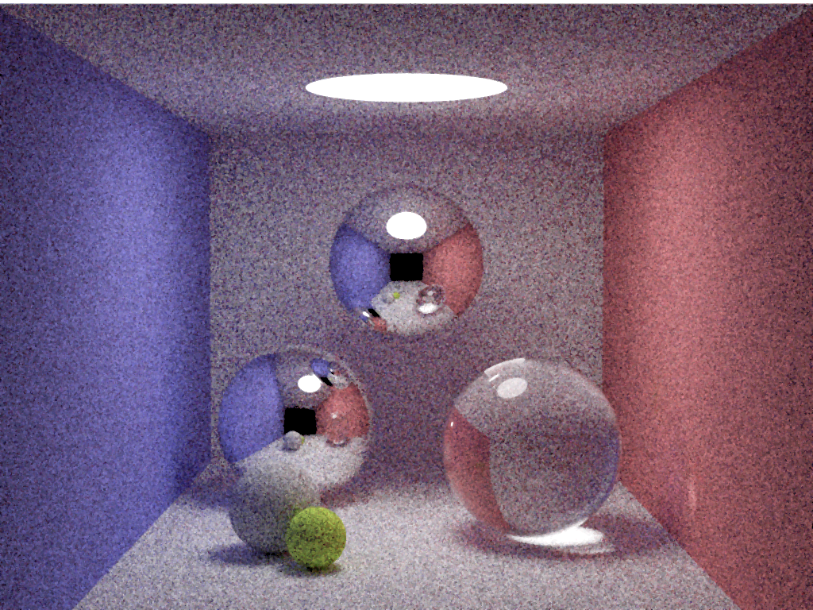
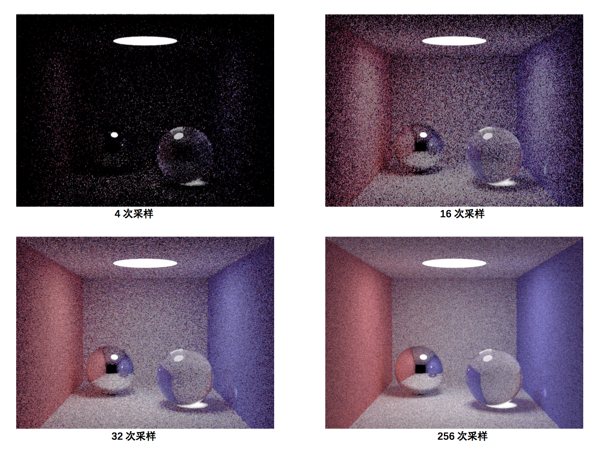
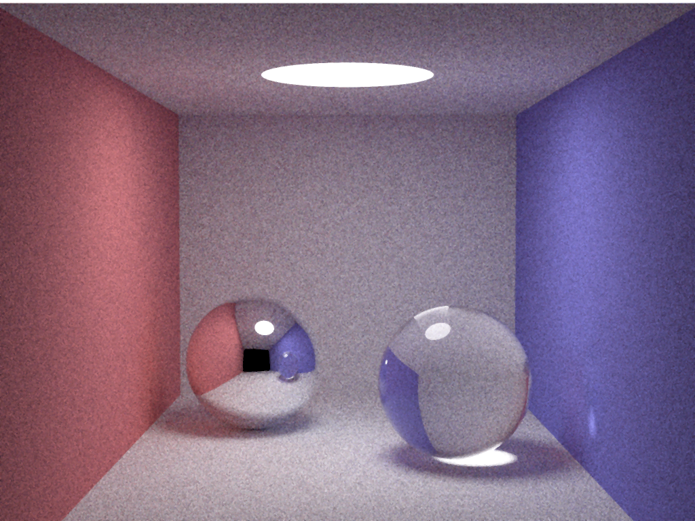

# TinyRayTracingRender

小型光线追踪渲染器
，渲染经典Cornell Box场景

使用:

●光线追踪

●蒙特卡洛方法

●2x抗锯齿

Result@64samples

各个采样数效果比较

256采样数结果

Reference:

[zhihu](https://zhuanlan.zhihu.com/p/29418992)

[CSDN](https://blog.csdn.net/qq_33274326/article/details/60779919)

[CSDN](https://blog.csdn.net/sunacmer/article/details/7451861)

[kevinbeason](http://www.kevinbeason.com/smallpt/)
